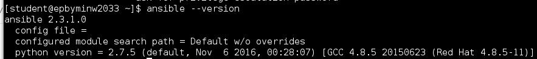
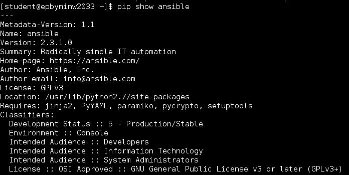
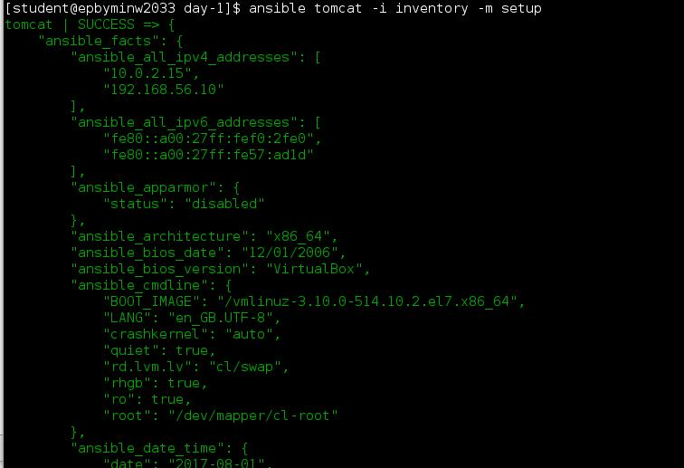
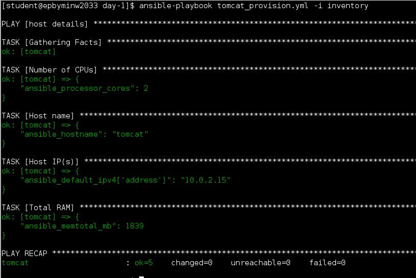
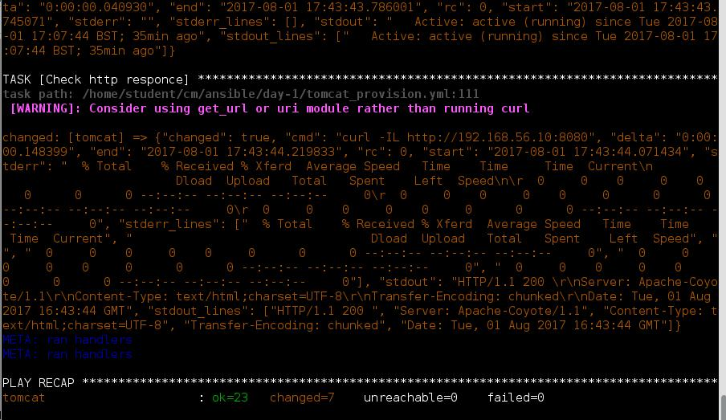
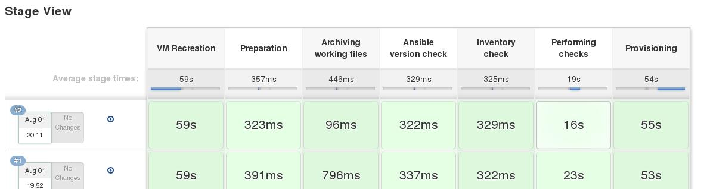

# Lab Work Task. Tomcat AS Provisioning
## Install Ansible v2.3.1 with python pip. Report details where ansible has been installed.
  
  
## Spin up clear CentOS7 VM using vagrant (“vagrant init sbeliakou/centos-7.3-minimal”). Verify connectivity to the host using ssh keys (user: vagrant)
[Vagrantfile](https://github.com/aion3181/Ansible/blob/master/day1/Vagrantfile)

```
      # -*- mode: ruby -*-
      # vi: set ft=ruby :

      # All Vagrant configuration is done below. The "2" in Vagrant.configure
      # configures the configuration version (we support older styles for
      # backwards compatibility). Please don't change it unless you know what
      # you're doing.
      Vagrant.configure("2") do |config|
        # The most common configuration options are documented and commented below.
        # For a complete reference, please see the online documentation at
        # https://docs.vagrantup.com.

        # Every Vagrant development environment requires a box. You can search for
        # boxes at https://atlas.hashicorp.com/search.
        config.vm.define "tomcat" do |tomcat|
          tomcat.vm.box = "tomcat"
          tomcat.vm.hostname = 'tomcat'
          tomcat.vm.box_url = "/home/student/cm/ansible/day-1/sbeliakou-vagrant-centos-7.3-x86_64-minimal.box"
          tomcat.vm.network "private_network", ip: "192.168.56.10"

          tomcat.vm.provider :virtualbox do |vb|
          vb.memory = "2048"
          end
      end
      end
```
## Create ansible inventory file (name: inventory) with remote host connection details. 
[inventory](https://github.com/aion3181/Ansible/blob/master/day1/inventory)
```
[all]
tomcat ansible_port=22 ansible_host=192.168.56.10 ansible_connection=ssh ansible_user=vagrant ansible_ssh_private_key_file=.vagrant/machines/tomcat/virtualbox/private_key
```

### Test ansible connectivity to the VM with ad-hoc command: $ ansible VM-name -i inventory -m setup


### Find out host details:


## Develop a playbook (name: tomcat_provision.yml) which is supposed to run against any host (specified in inventory)


[tomcat_provision.yml](https://github.com/aion3181/Ansible/blob/master/day1/tomcat_provision.yml)
```
- name: host details
  hosts: all
  
  tasks:
  - name: Number of CPUs
    debug: var=ansible_processor_cores
  - name: Host name
    debug: var=ansible_hostname
  - name: Host IP(s)
    debug: var=ansible_default_ipv4['address']
  - name: Total RAM
    debug: var=ansible_memtotal_mb

- name: provisioning
  hosts: all

  vars:
    tomcat_version: 8.5.0
    java_version: java-1.8.0-openjdk-devel.x86_64

  become: true
  
  tasks:
    - name: Ensure java is installed
      yum:
        name: "{{java_version}}"
        state: present

    - name: Ensure tomcat_as_group group exist
      group:
        name: tomcat_as_group
        state: present        

    - name: Ensure tomcat_as user exist
      user:
        name: tomcat_as
        group: tomcat_as_group
        state: present

    - name: Download Tomcat AS
      get_url:
        url: http://archive.apache.org/dist/tomcat/tomcat-8/v{{tomcat_version}}
        /bin/apache-tomcat-{{tomcat_version}}.tar.gz
        dest: /home/vagrant/

    - name: Ensure /opt/tomcat/$version is present
      file:
        path: /opt/tomcat/{{tomcat_version}}
        owner: tomcat_as
        group: tomcat_as_group
        state: directory
        mode: 0755

    - name: Ensure tomcat is unarchived
      unarchive:
        remote_src: yes
        src: /home/vagrant/apache-tomcat-{{tomcat_version}}.tar.gz
        dest: /home/vagrant/
        owner: tomcat_as
        group: tomcat_as_group

    - name: Copy tomcat to (CATALINA_HOME)=/opt/tomcat/$version
      shell: cp -R /home/vagrant/apache-tomcat-{{tomcat_version}}/* 
      /opt/tomcat/{{tomcat_version}} && chown -R tomcat_as:tomcat_as_group 
      /opt/tomcat/{{tomcat_version}}

    - name: Ensure tomcat.service script is present
      copy:
        src: tomcat.service
        dest: /etc/systemd/system/tomcat.service

    - name: Ensure tomcat.service script have right ExecStart
      lineinfile:
        path: /etc/systemd/system/tomcat.service
        regexp: '^ExecStart='
        line: 'ExecStart=/opt/tomcat/{{tomcat_version}}/bin/startup.sh'

    - name: Ensure tomcat.service script have right ExecStop
      lineinfile:
        path: /etc/systemd/system/tomcat.service
        regexp: '^ExecStop='
        line: 'ExecStop=/opt/tomcat/{{tomcat_version}}/bin/shutdown.sh'

    - name: Ensure tomcat.service script have right User
      lineinfile:
        path: /etc/systemd/system/tomcat.service
        regexp: '^User='
        line: 'User=tomcat_as'

    - name: Ensure tomcat.service script have right Group
      lineinfile:
        path: /etc/systemd/system/tomcat.service
        regexp: '^Group='
        line: 'Group=tomcat_as_group'

    - name: Ensure tomcat.service is enabled
      systemd:
        name: tomcat.service
        state: started
        daemon_reload: yes
        enabled: yes

    - name: Ensure tomcat is started
      service:
        name: tomcat
        state: started

    - name: Checking if tomcet.service is active
      shell: if [[ `systemctl is-active tomcat.service` -ne 'active' ]]; then exit 1; fi 

    - name: Check (runtime)
      shell: systemctl status tomcat.service | grep Active

    - name: Check http responce
      shell: if [[ `curl -IL localhost:8080 | grep "HTTP/1.1 200"` > 0 ]]; 
      then echo 'success'; else exit1; fi
```



