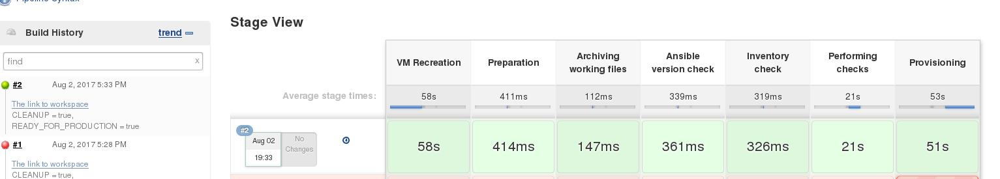
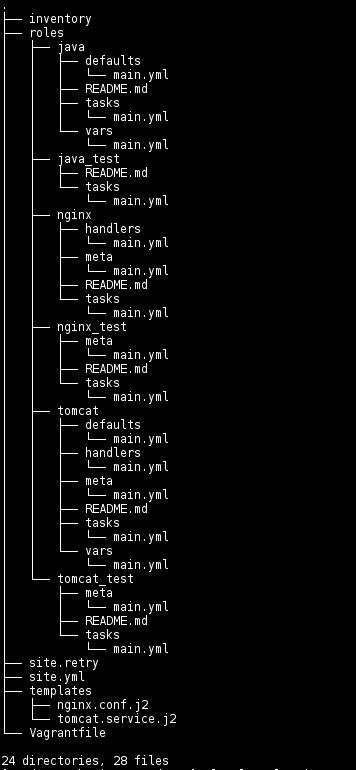

# Lab Work Task. Web Server Provisioning
### Review
#### Using Ansible v2.3.1 for provisioning nginx + tomcat application stack. 
#### Learning by doing.
### Task
####  Create ansible inventory file (name: inventory) with remote host connection details:
###### Remote VM hostname/ip/port
###### Remote ssh login username
###### Connection type
#### Develop a playbook (name: site.yml) which is supposed to run against any host (specified in inventory)
#### Develop roles:
###### - java (installs java)
###### - java_test (does only checks that java installed and running properly)
###### - tomcat (installs tomcat)
###### - tomcat_test (does only checks that tomcat installed and running properly)
###### - nginx (installs nginx)
###### - nginx_test (does only checks that nginx installed and running properly)
#### Playbook should consist of 2 Plays:
###### - Installation
###### - Verification
#### Use handlers to manage tomcat/nginx configuration changes
#### Use module debug to check configuration during the installation 
#### Define play/roles variables (at least):
###### - tomcat_version
###### - tomcat_home
###### - tomcat_user
###### - tomcat_group
###### - java_version
#### Every task/handler should have a name section with details of task purpose.

#### Software installation requirements:
##### Tomcat AS should be installed from sources (tar.gz) – download from the official site (http://archive.apache.org/dist/tomcat/).
##### Tomcat AS should be owned (and run) by user specified in variable (default: tomcat_as:tomcat_as_group).
##### Tomcat AS version should be 7.x, 8.x (at least 5 versions), exact version to be installed is taken from appropriate variable.
##### Tomcat installation folder (CATALINA_HOME) is /opt/tomcat/$version, where $version is the version of tomcat defined in playbook.
##### Java can be installed from CentOS Repositories
##### Use module yum to install Nginx
##### Use module template for management of nginx cofigs
##### Tomcat home page should be available on port 80 (accessible from Control Machile) via nginx.

# Result:
### [Vagrantfile](https://github.com/aion3181/Ansible/blob/master/day2/Vagrantfile)

  
  
  
  
### [site.yml:](https://github.com/aion3181/Ansible/blob/master/day2/site.yml)
```
    - name: Ensuring connectivity to the host using ssh keys
      hosts: tomcat

      tasks:
      - name: Host name
        debug: var=ansible_hostname


    - name: Installation
      hosts: tomcat
      become: true

      roles:
      - nginx


    - name: Verification
      hosts: tomcat

      roles:
    - nginx_test
```
### [inventory:](https://github.com/aion3181/Ansible/blob/master/day2/inventory)
```
    localhost

    [tomcat]
    192.168.56.10


    [tomcat:vars]
    ansible_port=22 
    ansible_connection=ssh 
    ansible_user=vagrant 
    ansible_ssh_private_key_file=.vagrant/machines/tomcat/virtualbox/private_key
```
## ===================================================================
## java role:
### [roles/java/defaults/main.yml:](https://github.com/aion3181/Ansible/blob/master/day2/roles/java/defaults/main.yml)
```
    java_version: java-1.6.0-openjdk-devel.x86_64
```
### [roles/java/tasks/main.yml:](https://github.com/aion3181/Ansible/blob/master/day2/roles/java/tasks/main.yml)
```
    - name: Ensure java is installed     
      yum:
        name: "{{java_version}}"
        state: present

    - name: Java info
      shell: java -version
      register: output

    - name: Installed java version
    debug: var=output
```
### [roles/java/vars/main.yml:](https://github.com/aion3181/Ansible/blob/master/day2/roles/java/vars/main.yml)
```
    java_version: java-1.7.0-openjdk-devel.x86_64
```
## ===================================================================
## java_test role:
### [roles/java_test/tasks/main.yml:](https://github.com/aion3181/Ansible/tree/master/day2/roles/java_test/tasks)
```
    - name: Checking java installation
      shell: java -version
      register: output4

    - name: Show result
    debug: var=output4
```
## ===================================================================
## nginx role:
### [roles/nginx/handlers/main.yml:](https://github.com/aion3181/Ansible/blob/master/day2/roles/nginx/handlers/main.yml)
```
    - name: nginx_service
      service:
        name: nginx
        state: started

    - name: nginx_restart
      service:
        name: nginx
    state: restarted
```
### [roles/nginx/meta/main.yml:](https://github.com/aion3181/Ansible/blob/master/day2/roles/nginx/meta/main.yml)
```
    dependencies: 
    - { role: tomcat }
```
### [roles/nginx/tasks/main.yml:](https://github.com/aion3181/Ansible/blob/master/day2/roles/nginx/tasks/main.yml)
```
    - name: Ensure nginx is installed     
      yum:
        name: nginx
        state: present
      notify: nginx_service

    - name: Ensure nginx config is updated
      template:
        src: templates/nginx.conf.j2
        dest: /etc/nginx/nginx.conf
      notify:
        - nginx_restart

    - name: Nginx config
      shell: cat /etc/nginx/nginx.conf
      register: output2

    - name: Show Nginx config
    debug: var=output2
```
## ===================================================================
## nginx_test role:
### [roles/nginx_test/meta/main.yml:](https://github.com/aion3181/Ansible/blob/master/day2/roles/nginx_test/meta/main.yml)
```
    dependencies: 
    - { role: tomcat_test }
```
### [roles/nginx_test/tasks/main.yml:](https://github.com/aion3181/Ansible/blob/master/day2/roles/nginx_test/tasks/main.yml)
```
    - name: Checking nginx service
      shell: if [[ `systemctl is-active tomcat.service` -ne 'active' ]]; 
      then exit 1; fi

    - name: Check nginx http responce
      shell: if [[ `curl -IL localhost:80 | grep "HTTP/1.1 200"` > 0 ]]; 
      then echo 'success'; else exit 1; fi  

    - name: Check nginx http proxy page
    shell: if [[ `curl localhost:80 | grep "Apache Tomcat/"` > 0 ]]; 
    then echo 'success'; else exit 1; fi
```
## ===================================================================
## tomcat role:
### [roles/tomcat/defaults/main.yml:](https://github.com/aion3181/Ansible/blob/master/day2/roles/tomcat/defaults/main.yml)
```
    tomcat_version: 7
    tomcat_release: 7.0.50
    tomcat_home: /opt/tomcat/{{tomcat_release}}/
    tomcat_name: apache-tomcat-{{tomcat_release}}
    tomcat_url: http://archive.apache.org/dist/tomcat/tomcat-{{tomcat_version}}
    /v{{tomcat_release}}/bin/{{tomcat_name}}.tar.gz
    tomcat_user: tomcat_as
    tomcat_group: tomcat_as_group
```
### [roles/tomcat/handlers/main.yml:](https://github.com/aion3181/Ansible/blob/master/day2/roles/tomcat/handlers/main.yml)
```
    - name: systemd_service
      systemd:
        name: tomcat.service
        state: started
        daemon_reload: yes
        enabled: yes

    - name: tomcat_service
      service:
        name: tomcat
    state: started
```
### [roles/tomcat/meta/main.yml:](https://github.com/aion3181/Ansible/blob/master/day2/roles/tomcat/meta/main.yml)
```
    dependencies: 
    - { role: java, java_version: java-1.8.0-openjdk-devel.x86_64 }
```
### [roles/tomcat/tasks/main.yml:](https://github.com/aion3181/Ansible/blob/master/day2/roles/tomcat/tasks/main.yml)
```
    - name: Ensure tomcat_group exist
      group:
        name: "{{tomcat_group}}"
        state: present        

    - name: Ensure tomcat_user exist
      user:
        name: "{{tomcat_user}}"
        group: "{{tomcat_group}}"
        state: present

    - name: Download Tomcat AS
      get_url:
        url: "{{tomcat_url}}"
        dest: /home/vagrant/

    - name: Ensure CATALINA_HOME is present
      file:
        path: "{{tomcat_home}}"
        owner: "{{tomcat_user}}"
        group: "{{tomcat_group}}"
        state: directory
        mode: 0755

    - name: Ensure tomcat is unarchived
      unarchive:
        remote_src: yes
        src: /home/vagrant/{{tomcat_name}}.tar.gz
        dest: "{{tomcat_home}}"
        owner: "{{tomcat_user}}"
        group: "{{tomcat_group}}"

    - name: Ensure owner of tomcat files is "{{tomcat_user}}"
      shell: chown -R "{{tomcat_user}}":{{tomcat_group}} {{tomcat_home}}{{tomcat_name}}

    - name: Ensure tomcat.service script is present
      template:
        src: templates/tomcat.service.j2
        dest: /etc/systemd/system/tomcat.service
      notify:
        - systemd_service 
        - tomcat_service

    - name: tomcat.service config
      shell: cat /etc/systemd/system/tomcat.service
      register: output3

    - name: Show tomcat.service config
      debug: var=output3

    - name: force all notified handlers to run at this point, not waiting for normal sync points 
      meta: flush_handlers

    - name: Checking if tomcet.service is active
    shell: if [[ `systemctl is-active tomcat.service` -ne 'active' ]]; then exit 1; fi 
```
### [roles/tomcat/vars/main.yml:](https://github.com/aion3181/Ansible/blob/master/day2/roles/tomcat/vars/main.yml)
```
    tomcat_version: 8
    tomcat_release: 8.5.0
```
## ===================================================================
## tomcat_test role:
### [roles/tomcat_test/meta/main.yml:](https://github.com/aion3181/Ansible/blob/master/day2/roles/tomcat_test/meta/main.yml)
```
    dependencies: 
    - { role: java_test }
```
### [roles/tomcat_test/tasks/main.yml:](https://github.com/aion3181/Ansible/blob/master/day2/roles/tomcat_test/tasks/main.yml)
```
    - name: Checking tomcat service
      shell: if [[ `systemctl is-active tomcat.service` -ne 'active' ]]; 
      then exit 1; fi

    - name: Check tomcat http responce
      shell: if [[ `curl -IL localhost:8080 | grep "HTTP/1.1 200"` > 0 ]]; 
      then echo 'success'; else exit 1; fi  

    - name: Check tomcat http page
    shell: if [[ `curl localhost:8080 | grep "Apache Tomcat/"` > 0 ]]; 
    then echo 'success'; else exit 1; fi
```
## ===================================================================
## templates:
### [templates/nginx.conf.j2:](https://github.com/aion3181/Ansible/blob/master/day2/templates/nginx.conf.j2)
### [templates/tomcat.service.j2:](https://github.com/aion3181/Ansible/blob/master/day2/templates/tomcat.service.j2)
```
    # Systemd unit file for tomcat
    [Unit]
    Description=Apache Tomcat Web Application Container
    After=syslog.target network.target

    [Service]
    Type=forking

    ExecStart={{tomcat_home}}{{tomcat_name}}/bin/startup.sh
    ExecStop={{tomcat_home}}{{tomcat_name}}/bin/shutdown.sh

    User={{tomcat_user}}
    Group={{tomcat_group}}
    UMask=0007
    RestartSec=10
    Restart=always

    [Install]
    WantedBy=multi-user.target
```


